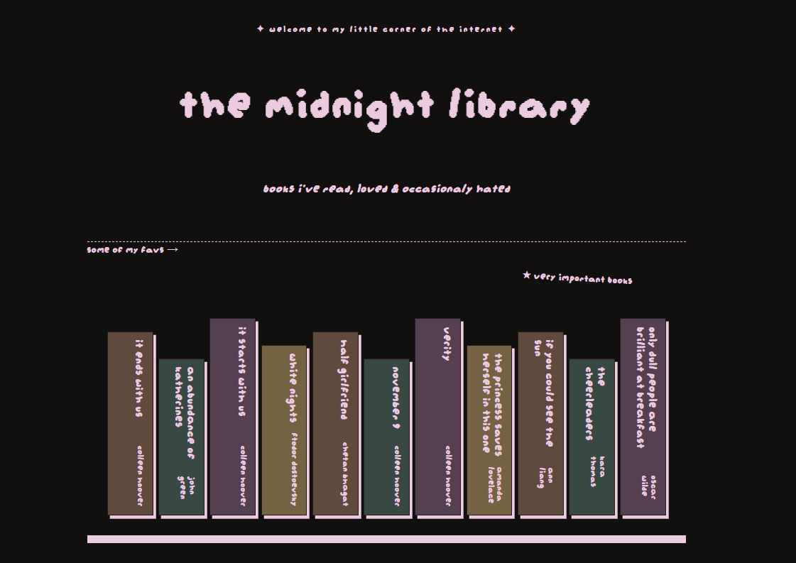

# The Midnight Library

## What It Is

Just a simple website to show some of my book recommendations or just books that left somewhat of an impression on me!

## How I Made It

Tech stack:

- HTML
- CSS

Most of it is just rectangles together, I just wanted to see how far I could go with just rectangles (not a lot I guess). Pretty straightforward website as it's just static with simple information.

## What I Struggled With & What I Learnt

I didn't really struggle with a lot since it's simple, just struggled with figuring out how to add a .ttf font to my project but except that everything was a breeze. Figuring out what format I want things to be was my biggest struggle.

## Screenshots

